# Django ToDo App Overview

## Introduction

The Django ToDo App is a web-based application designed to help users manage their tasks efficiently. Leveraging the power of the Django web framework, this app provides a user-friendly interface for creating, updating, and organizing tasks.

## Features

- Task Management: Perform essential CRUD (Create, Read, Update, Delete) operations on tasks.
- User Authentication: Secure user accounts with authentication to ensure personalized task management.
- Responsive Design: The app is built with responsiveness in mind, making it accessible on various devices and screen sizes.

## How It Works

- User Registration and Login: Users can create accounts by registering with a unique username and password. Existing users can log in to access their tasks.

- Task Creation: Once logged in, users can create new tasks by providing a task title, description, and other relevant details.

- Task Listing: The app displays a list of tasks, showing essential information such as task title, status, and deadline.

- Task Details and Editing: Users can view detailed information about each task and have the ability to edit task details or mark tasks as completed.

- Task Deletion: Users can delete tasks they no longer need, helping to keep their task list organized.

## Technologies Used

- Django: A high-level Python web framework that encourages rapid development and clean, pragmatic design.
- HTML/CSS: Frontend development for creating a visually appealing and responsive user interface.
- SQLite (or other database): Used for storing task and user information.

## Prerequisites

Make sure you have the Python installed:

- Python (version 3.x recommended)

## Note:

In the command line, type `python`. If Python is installed, you should see a message like “Python 3.x.x” followed by the Python prompt, which looks like this “>>>”. Note that “3.x.x” represents the version number of Python

```bash
python
# OR
python --version
```

**1.Clone the Repo**

```sh
git clone https://github.com/Kaiyrtay/Django-TODOAPP.git
cd Django-TODOAPP
```

**2.Install Requirements**

```sh
pip install -r requirements.txt
```

**3.Create .env**

```sh
cd ~/Django-TODOAPP/todo_list
touch .env
```

At your .env file:

```bash
DEBUG=True/False

SECRET_KEY=<your_value>

EMAIL_USER=<your_value>
EMAIL_PASSWORD=<your_value>
```

**4.Apply migrations:**

```bash
python manage.py makemigrations
python manage.py migrate
```

**5.Create a superuser (admin):**

```bash
python manage.py createsuperuser
```

**6.Start the development server:**

```bash
python manage.py check
python manage.py runserver
```

# Demo:

## Homepage

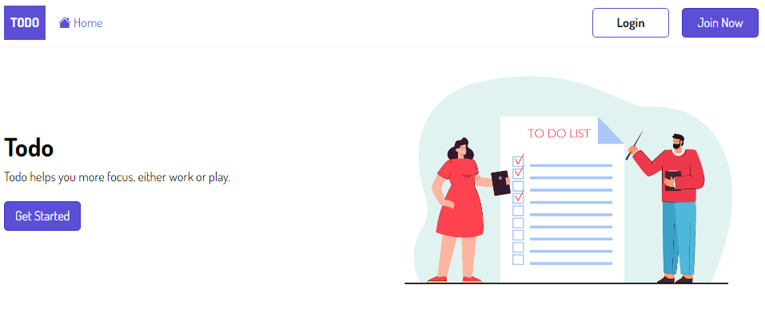
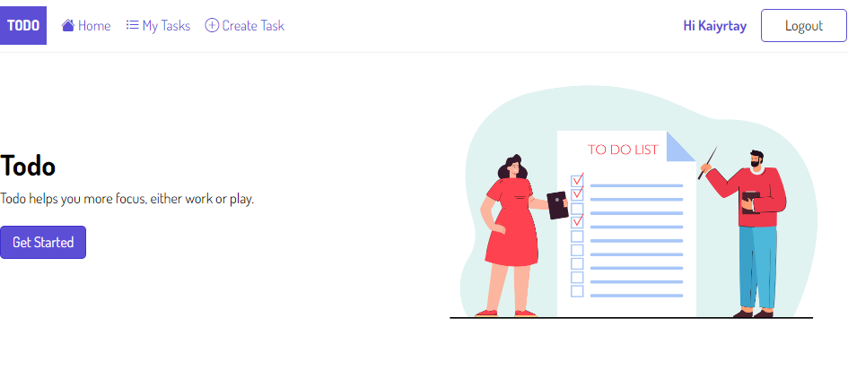

## Login

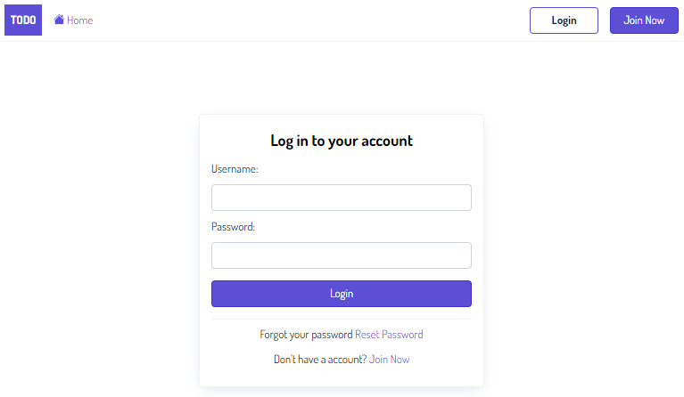

## Register

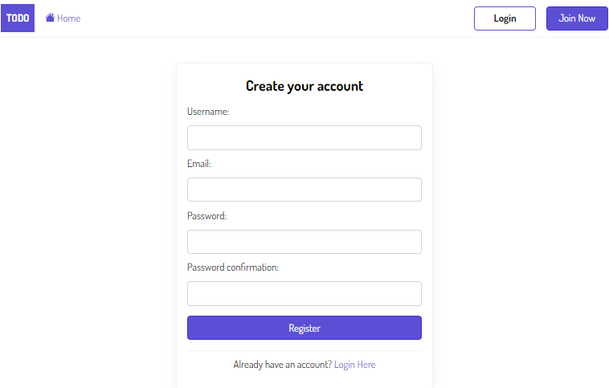

## Profile

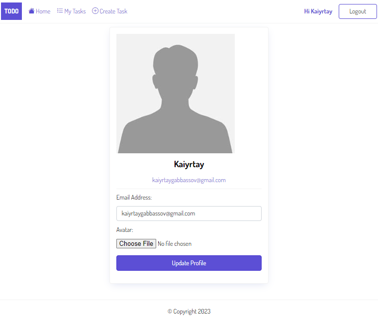

## Password reset

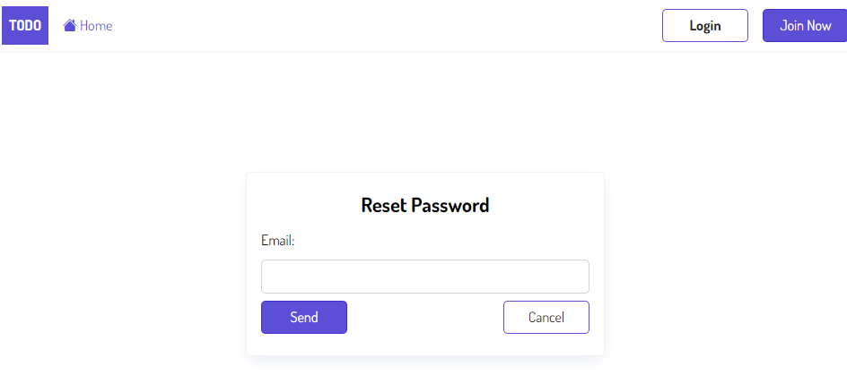

## Password reset done

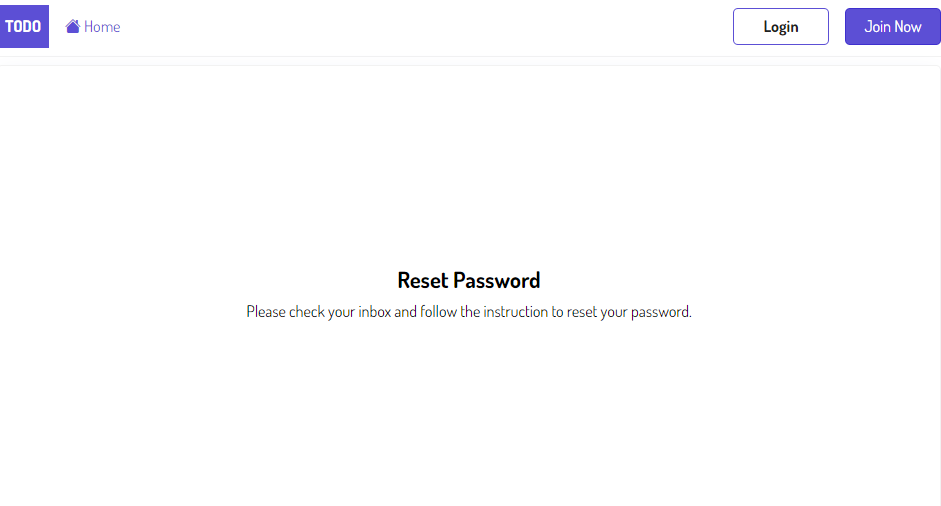

## Password reset email

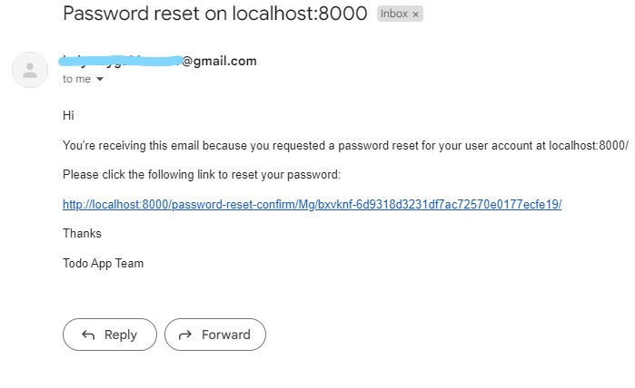

## Password reset conf

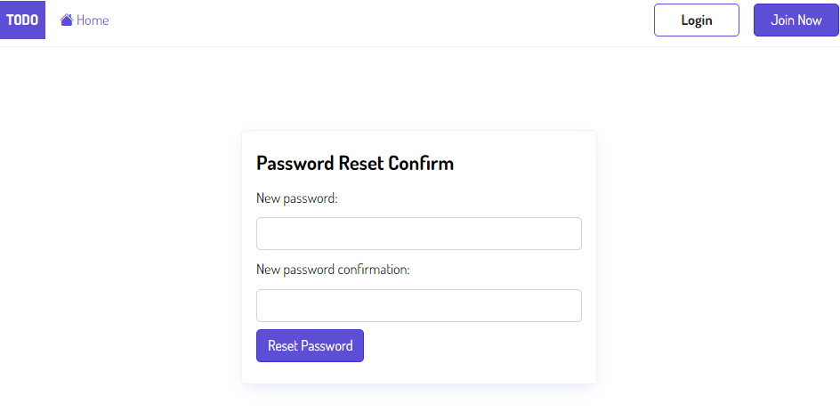

## Password reset complete

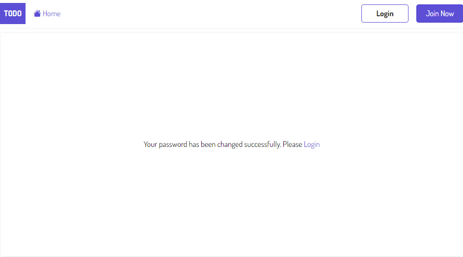

## Tasks list

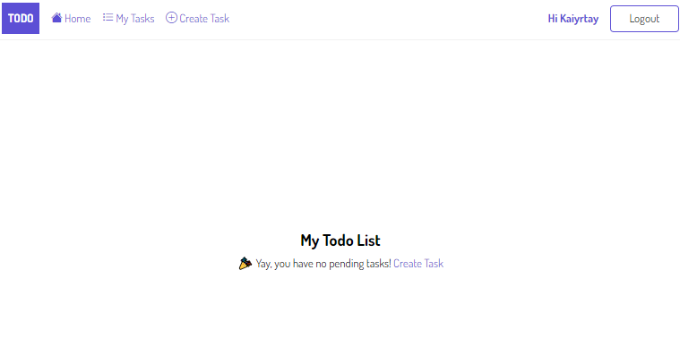

## Create task

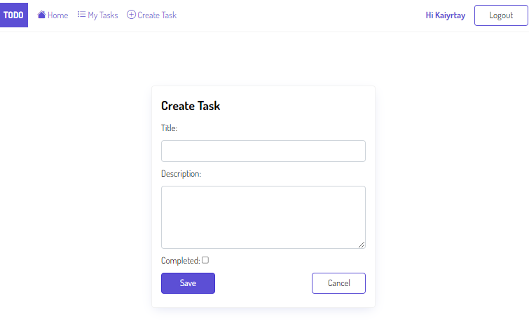

## Tasks list

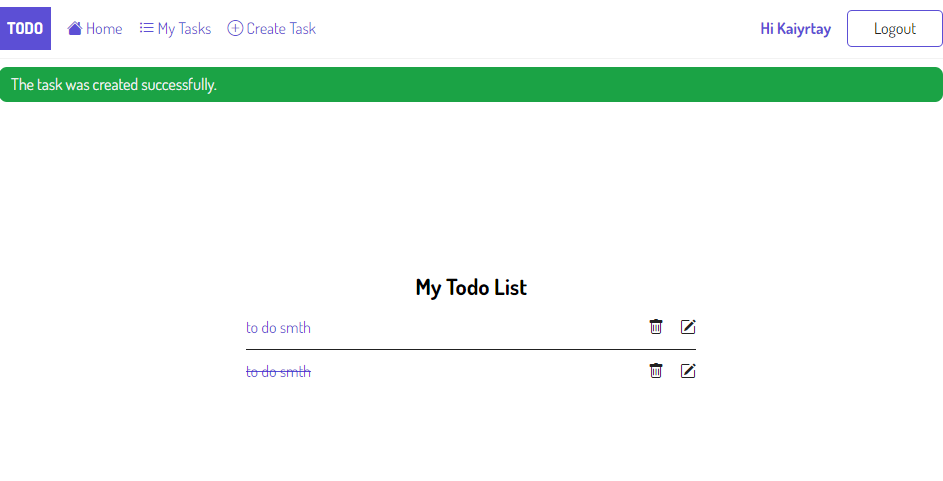

## Logout

Goes [back to login page](#login)

# End

> Good luck, more detail go to [pythontutorial.net](https://www.pythontutorial.net/django-tutorial)
